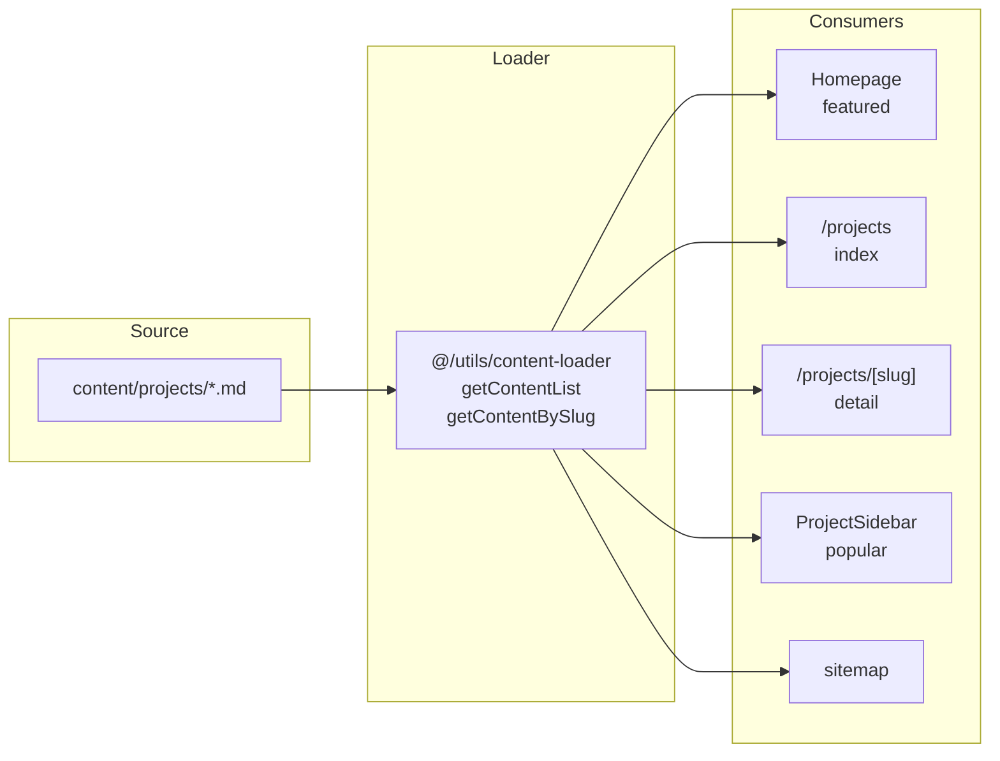

# Data Flow

Single source of truth for how content is loaded across the site. This is the canonical reference for architects and developers.

## Overview

| Content type | Source | Loader / API | Used by |
|-------------|--------|--------------|---------|
| **Projects** | Markdown in `content/projects/` | `@/utils/content-loader` (`getContentList` / `getContentBySlug` for `'projects'`) | Homepage (featured), `/projects`, `/projects/[slug]`, sidebars, sitemap |
| **Blog** | Markdown in `content/blog/` | `@/utils/content-loader` (`getContentList` / `getContentBySlug` for `'blog'`) | `/blog`, `/blog/[slug]`, sitemap |

Projects and blog both use the **content-loader**; project data comes only from markdown in `content/projects/`.

## Project data flow

- **Homepage:** First 2 projects from `getContentList<Project>('projects')` for the featured section; links to `/projects/[slug]`.
- **Projects index:** `getContentList<Project>('projects')` for the full list; cards link to `/projects/[slug]`.
- **Project detail:** `getContentBySlug<Project>('projects', slug)` for metadata and body; `generateStaticParams` from the same list.
- **Sidebars:** First 2 projects from content-loader for “Popular Projects.”
- **Sitemap:** Project URLs generated from `getContentList<Project>('projects')`.

## Blog data flow

- **Source:** `content/blog/*.md`
- **Loader:** `getContentList<BlogPost>('blog')` and `getContentBySlug<BlogPost>('blog', slug)` from `@/utils/content-loader`
- **Used by:** Blog index, blog post pages, layout (recent posts), sitemap

## File reference

| Purpose | File |
|--------|------|
| Content loader (blog + projects) | [src/utils/content-loader.ts](../src/utils/content-loader.ts) |
| Project content | [content/projects/](../content/projects/) |
| Blog content | [content/blog/](../content/blog/) |

## Adding or changing project data

1. Add or edit a markdown file in `content/projects/` (e.g. `my-project.md`) with the required frontmatter (title, slug, excerpt, status: published, etc.). See [content-loader](../src/utils/content-loader.ts) `Project` interface and [placeholder](../content/projects/placeholder.md) for shape.
2. No code changes needed; the site uses the content-loader for all project pages.
3. Run build to regenerate static routes and sitemap.
